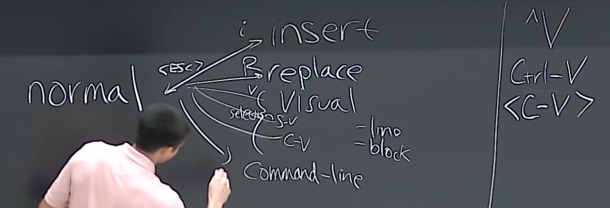
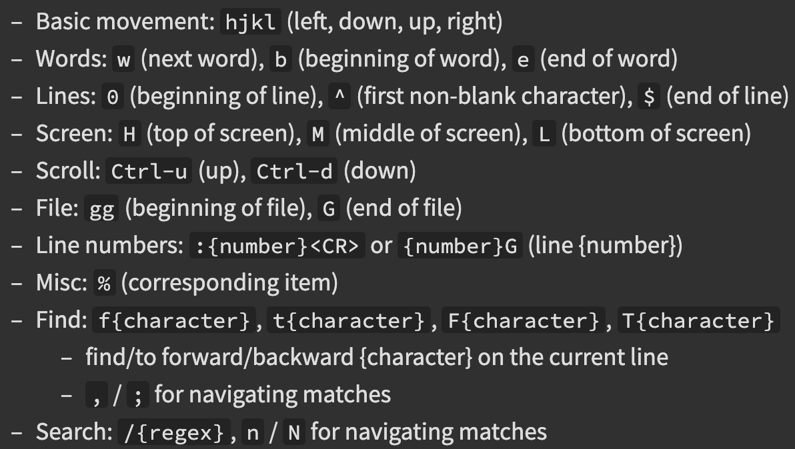

# VIM

- modal editor: normal (esc), insert (i), replace (R), selection (v) {visual line (shift-v), visual block (ctrl-v)}, command line (:)

  

  - [Theory/Philosohpy](https://missing.csail.mit.edu/2020/editors/)

- Most rebind esc to caps key
  - Linux: `setxkbmap -option caps:escape` # This will do this for everywhere on your system!
  - Mac: [Vim Fandom Link](vim.fandom.com/wiki/Maps_caps_lock_to_escape_in_macOS)
- Vim IS a programming language

## Buffers, tabs, and windows

- **Buffers** = set of open files
- **Tabs** = Think Chrome Tabs. Tabs can have windows.
  - `:tabnew`
  - *OR* vim -p tab1 tab2 tab3
  - rearrange tabs with `:tabm n`
- **Windows** = Think top and bottom on a single terminal mental picture
	- sp in normal mode to create a new window
	- `:Wj` and `:Wk` to switch between windows

## Movements (Nouns)

