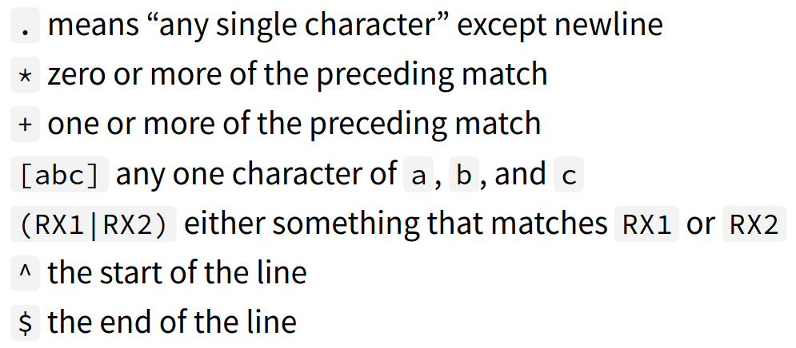

## Data Wrangling 

Linux: journalctl lets you view system log
Nginx: /var/log/nginx/access.log#

## Regex reminders with SED

`$echo 'aba' | sed 's/[ab]//'` 
`>ba`

`$echo 'abcaba' | sed -E 's/(ab)*//g'` # -E uses modern syntax or '()' need to be backslashed
`>ca`

* REGEX debugger: regex101.com 

## awk (Another editor)

* It exists

## bc (Berkley Calc)

`${some cmd that outputs each lines with a number} | paste -sd+ | bc -l`

##Other stuff

* Fetch data with curl (webpage), wget (webpage), pup (HTML), jq (JSON)
