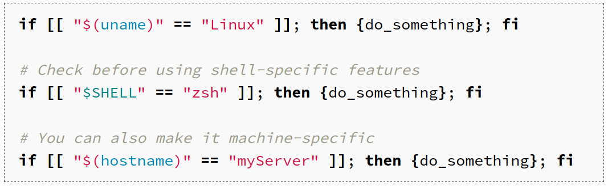
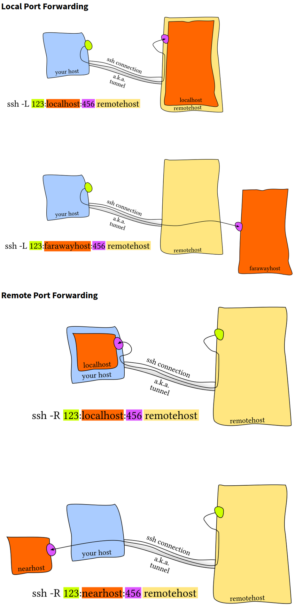

## Overview

1. Job control - signals, fg, bg, jobs
2. Terminal multiplexes - tmux (15:25)
3. Dotfiles (~30)
4. Remote management ()

### TMUX (Terminal Multiplexer)

- <C-b>x form
	- Press Ctrl+b release then press x
	- Not to be confused with vimsplit's (Ctrl+w & v/s)
- sessions (init $tmux)
- 
	- Windows aka tabs
	- 
		- panes aka like vim splits (same file different location)
		-  

### Dotfiles & Aliases

* `$alias mv="mv -i"           # -i prompts before overwrite`
* `$unalias la`
* symlinks
	* `$ln -s path/to/file symlink`
	* Ex: `$ln -s /mnt/my_drive/movies ~/my_movies` or `$ln -s ~/Dropbox/dotfiles/.bashrc ~/.bashrc`
* 

### SSH

* Get familiar with ssh-agent(d)
* sshfs to mount a folder on a remote server locally

#### Port Forwarding

* `~/.ssh/config.`
* 

* [Shell startup scripts](https://blog.flowblok.id.au/2013-02/shell-startup-scripts.html)
* [Vim by Doug Black](https://dougblack.io/words/a-good-vimrc.html)
* [dotfiles](https://dotfiles.github.io/utilities)
* [All about terminal emulators](https://anarc.at/blog/2018-04-12-terminal-emulators-1)
