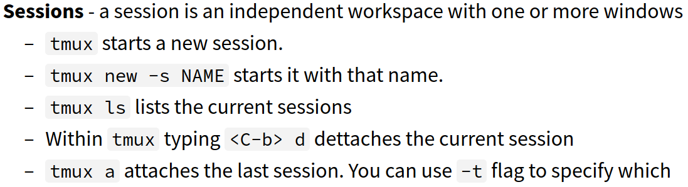
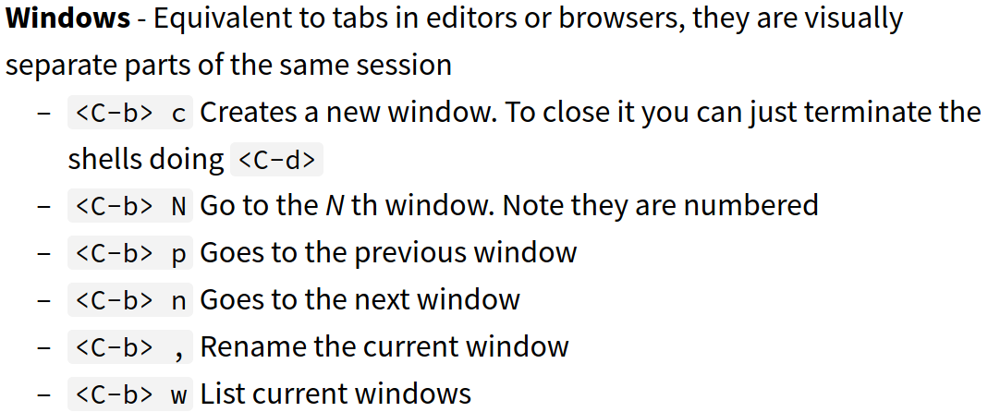
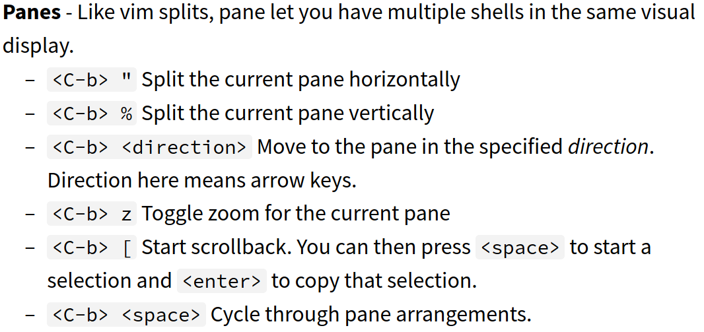

## Overview

1. Job control - signals, fg, bg, jobs
2. Terminal multiplexes - tmux
3. Dotfiles
4. Remote management

### TMUX (Terminal Multiplexer)

- <C-b>x form
	- Press Ctrl+b release then press x
- sessions (init $tmux)
- 
	- Windows aka tabs
	- 
		- panes aka like vim splits (same file different location)
		-  

### Dotfiles & Aliases

* `$alias mv="mv -i"           # -i prompts before overwrite`

* [Shell startup scripts](https://blog.flowblok.id.au/2013-02/shell-startup-scripts.html)
* [Vim by Doug Black](https://dougblack.io/words/a-good-vimrc.html)
* [dotfiles](https://dotfiles.github.io/utilities)

