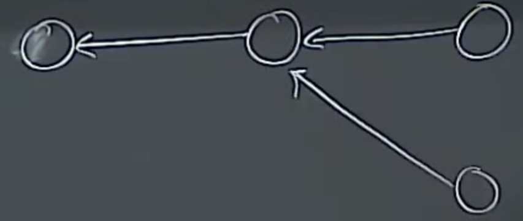
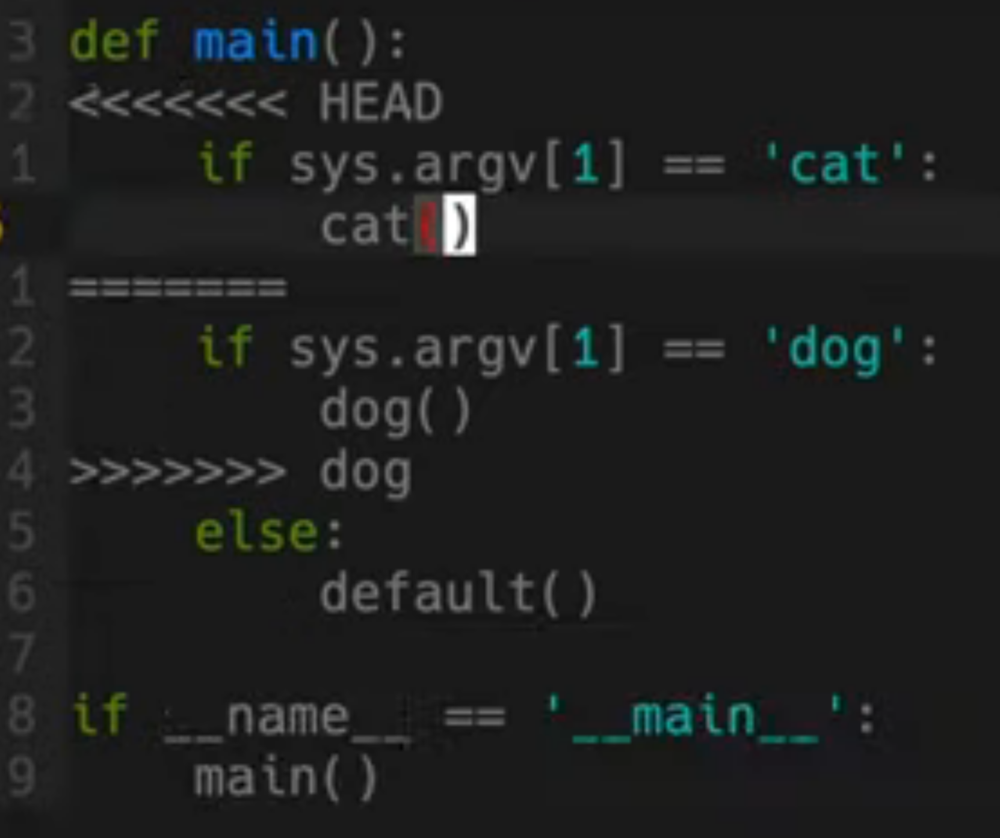
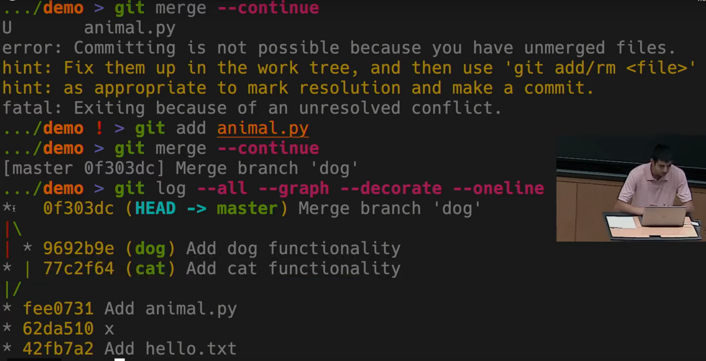

# GIT

* Aka version control system (VCS)
* 'Trees' are folders and files are 'blobs'
* Uses directed acyclic graph where every node is a snapshot
	* Each points **BACK** to another (not forward)
	* fork history
		* 

## DEMO
1. git init (creates .git dir)
2. git add
3. git commit
	* [good commit msg's](https://tbaggery.com/2008/04/19/a-note-about-git-commit-messages.html)
		* Ex: `Capitalized, short (50 chars or less) summary`
		* git log --pretty=oneline shows a terse history mapping containing the commit id and the summary
	* git commit -a
4. git log --all --graph --decorate (also git status)
	* Best: `$git log --all --graph --decorate --oneline` 
5. git checkout <insert old hash | fileToRevert> # HEAD will change
	* can also do $git checkout master
	* $git checkout -b <branchName> does `$git branch; git checkout`
6. git diff <hash/HEAD> <file/otherHash>
	* If unsure what's different (when dealing with branches, can just run `$git diff` to see)
7. git merge
	* If error, DONT FREAK.
		* git mergetool (use vimdiff)
	* Also, Fast-Forward just means HEAD/Master now points to merged branch
	* `$git merge --abort` will put back in state before the merge
	* 
	* 

## Git Remote(~1:02:00)

* `$git remote` lists all remotes git is aware of for current repo.

## TMUX reminders

* flip panes - Prefix+{ or } **OR** Prefix+O (oh)
* switch panes - Prefix+o
* create pane - Prefix+%
* exit tmux - Prefix+x
