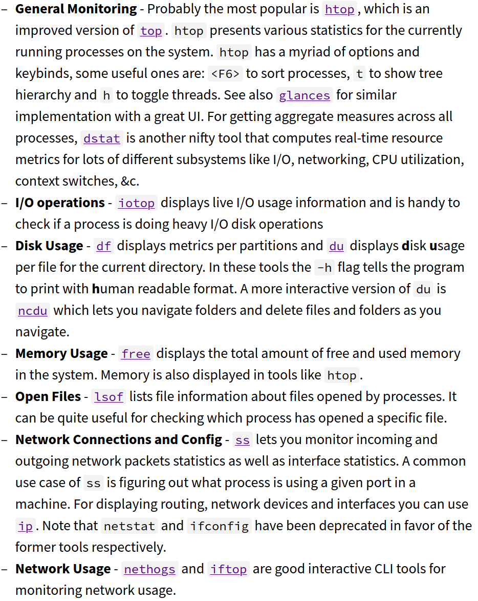

# Debugging

1. Print statements
2. Logs
	* `/var/log`
	* In Mac: `$log 1show --last 10s # Last 10 seconds of /var/log/system.log`
	* Linux: `$dmesg`
3. Debuggers
	* `$python -m ipdb *.py # Python Debugger`
		* `ipdb> p locals() # returns all vars`
	* gdb
4. Tracing (strace)
	* `$sudo strace ls -l > /dev/null # ignore output of ls`
	* `$sudo strace -e lstat ls -l > /dev/null # checks for properties of files`
5. Static Analysis Tools (Linters)
	* Python's pyflakes or mypy
	* Integrate it into editor
		* Ex: ALE in vim
	* English Linter: [writegood](https://github.com/btford/write-good), proselint
	* [List of linters](https://github.com/caramelomartins/awesome-linters)

# Profiling

`$time`
1. real - entire length
2. user - program spends on CPU doing "user-level cycles"
3. system - time program spends on "kernel-level instructions"

### CPU Profilers (Think back to CompArch class)

1. Tracing - time/resources indidivudal functions and basic blocks. But a lot of overhead.
2. Sampling - every _n_ seconds will stop program and give stats.

* `$python -m cProfile -s tottime urls.py | tac` #
	- $tac is opposite of cut
* `$kernprof -l -v urls.py` # More human-readable [AKA Line Profiling]
* Other benchmarking tool: [hyperfine](https://github.com/sharkdp/hyperfine)

### Memory Profiles

* valgrind for c
* memory-profiler with decorators (`@profile`) in python 

### Event Profilers

* [perf](http://man7.org/linux/man-pages/man1/perf.1.html)

### Visualization

* [Using Flame Graphs](http://www.brendangregg.com/flamegraphs.html)
* [pycallgraph](http://pycallgraph.slowchop.com/en/master/)

### Resource Monitoring

### Bonus

- `$python -m http.server 4444 # opens a server on port 4444`
